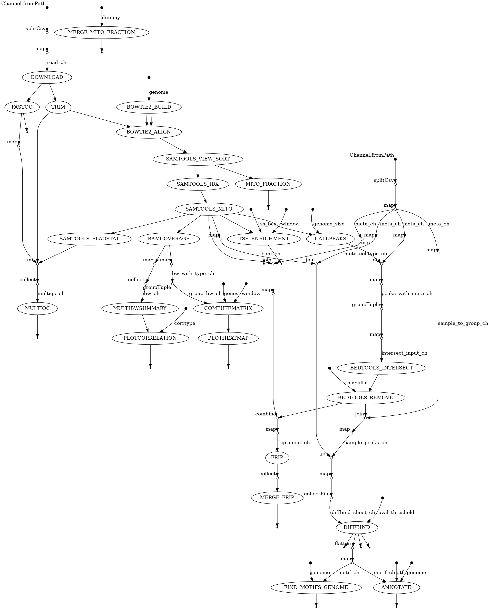

### Introduction

The study focuses on how a chromatin regulator, the histone deacetylase HDAC1, controls the development of different dendritic cell (DC) subsets and how this affects anti-tumor immune responses. Dendritic cells are crucial for activating T cells against cancer, but it was not clear how specific chromatin-modifying enzymes shape the transcription factor networks that drive DC lineage choices such as cDC1, cDC2, and pDCs. The authors therefore knockout HDAC1 and compared it with HDAC2 in mouse hematopoietic and DC compartments to see how DC development, T cell activation, and tumor control changed. To understand the mechanism, RNA-sequencing was used to measure the gene expression, ATAC-seq to assess chromatin accessibility, and CUT&RUN to map histone acetylation, allowing them to link HDAC1 loss to altered accessibility and expression at key transcription factor genes (like IRF4, IRF8, and SPIB) that determine DC subset fate and, ultimately, the strength of anti-tumor immunity. Here, the bioinformatics analysis of ATAC-sequencing is done to reproduce figure 6a-f and provide an overview of the experiment. 

### Methods

#### Quality control, genome indexing, and alignment 
ATAC‑seq data for wild‑type (WT) and knockout (KO) conditions (two biological replicates per condition) were downloaded from NCBI GEO (accession GSE266584). Single‑end FASTQ files underwent initial quality assessment using FastQC v0.12.1, and sequencing adapters and low‑quality bases were removed with Trimmomatic v0.40 using default parameters. The Mus musculus GRCm38 (mm10) reference genome and corresponding annotations were obtained from GENCODE, and a Bowtie2 v2.5.4 index was built using the --very-sensitive preset. Trimmed reads were aligned to the indexed mm10 genome with Bowtie2, and the resulting SAM files were converted, sorted, and indexed as BAM files using SAMtools v1.22 with default parameters. Mitochondrial reads were removed from each BAM file using SAMtools, and alignment statistics were computed with samtools flagstat v1.22 for each sample. A comprehensive quality control report was generated by aggregating outputs from FastQC, Trimmomatic, and samtools flagstat using MultiQC v1.25. 

#### Read coverage and correlation analysis 
Genome‑wide read coverage was computed and normalized bigWig files were generated for each sample using deepTools bamCoverage v3.5.6. Sample similarity was quantified from bigWig files with deepTools multiBigwigSummary v3.5.6 using default parameters, and correlation coefficients were visualized as a heat map with plotCorrelation. A BED file containing transcription start and termination site coordinates for all mm10 genes was retrieved from the UCSC Table Browser and scaled to gene bodies with 1,500 bp upstream and downstream flanks using deepTools computeMatrix in scale‑regions mode. The resulting matrices were used to visualize read‑coverage heat maps for WT and KO cDC1 and cDC2 samples with deepTools plotHeatmap. 

#### Peak calling and annotation 
Peak calling was performed on mitochondrial‑filtered BAM files using MACS3 with the options --keep-dup auto, --nomodel, --extsize 147, --shift 0, and --nolambda. Enriched regions in cDC1 and cDC2 samples were further assessed with HOMER findPeaks using default parameters. Reproducible peaks for each condition were defined as the intersection of peaks from the two biological replicates using intersect from BEDtools v2.31.1. These reproducible peak sets were filtered to remove overlaps with the ENCODE mm10 blacklist (obtained from Boyle Laboratory) using bedtools intersect with default parameters. Comprehensive gene annotations corresponding to primary transcript regions were downloaded from GENCODE and used to annotate the final filtered peaks to the nearest genomic features with HOMER annotatePeaks.pl, specifying the mm10 genome and GTF annotation. 

#### Downstream analyses 
Differential chromatin accessibility between cDC1 and cDC2 in WT and KO conditions was assessed in R using the DiffBind package, applying a minimum fold‑change threshold of 0.20 for defining differentially accessible regions. Motif enrichment analysis was performed on the reproducible, blacklist‑filtered peak sets using HOMER findMotifsGenome.pl with default parameters to identify enriched known and de novo transcription factor binding motifs.

Below is a DAG generated from the Nextflow pipeline 

