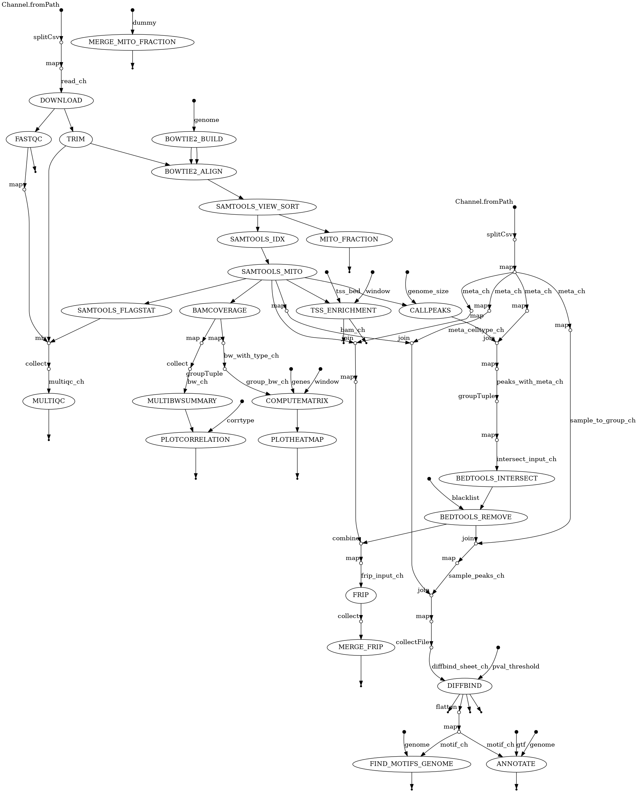
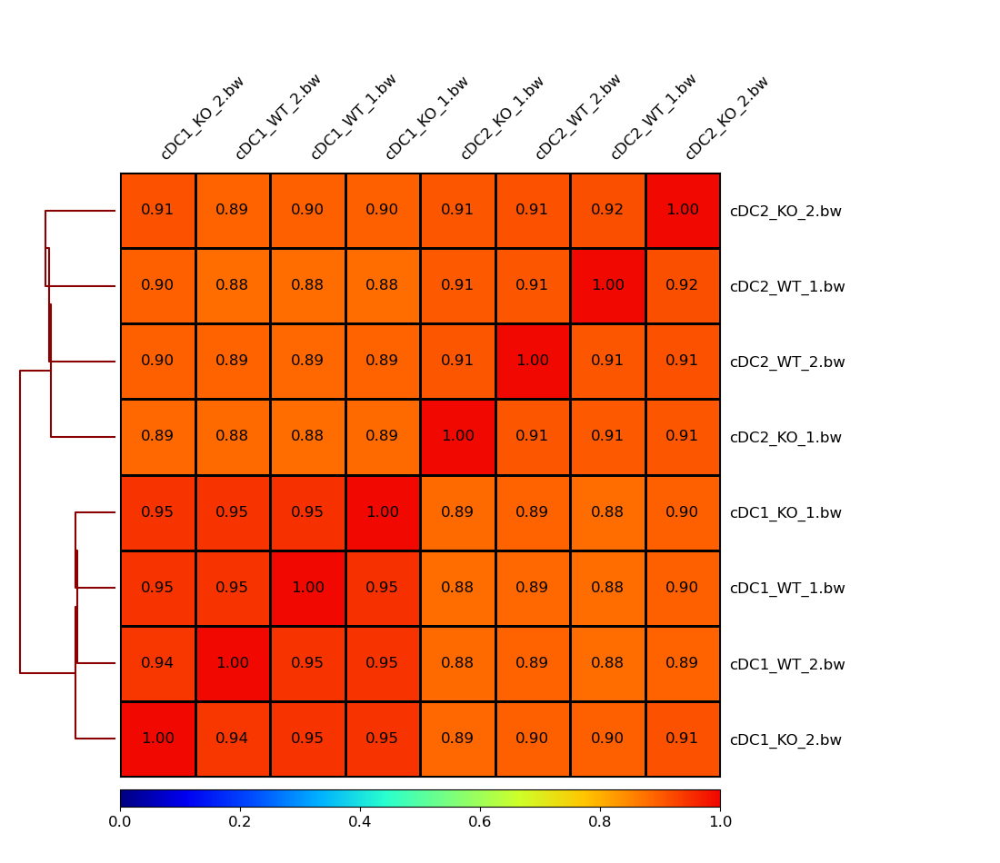
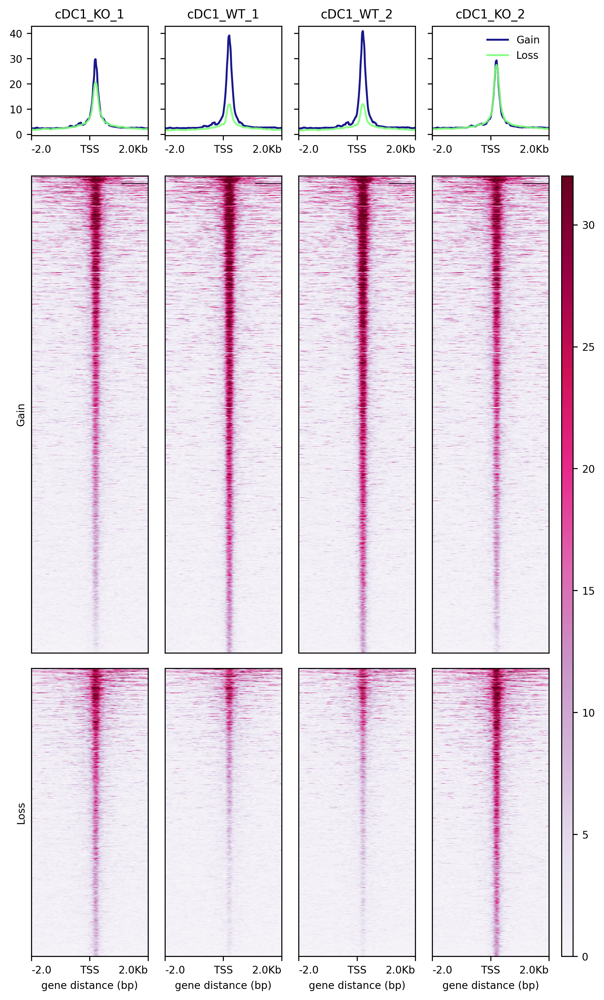
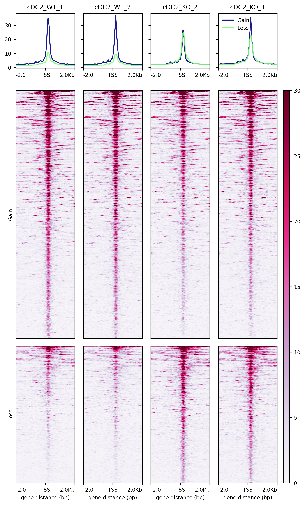
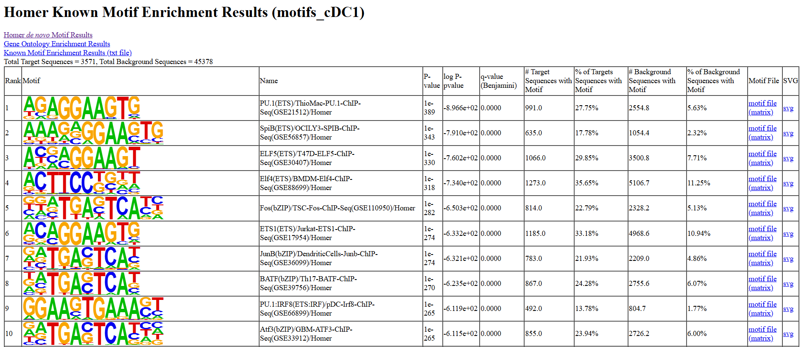
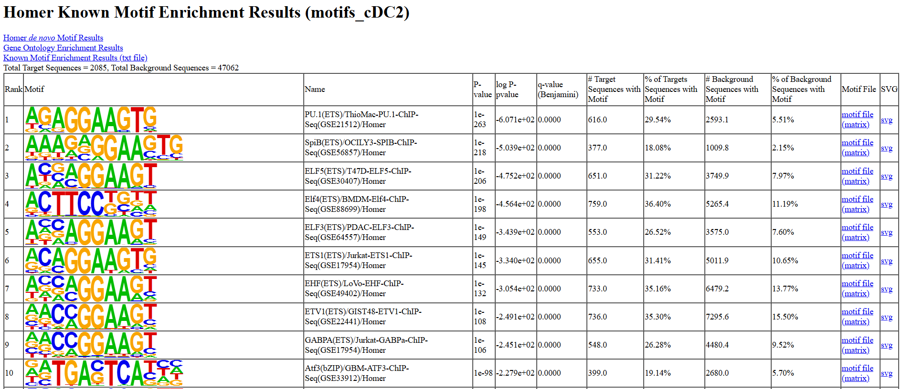
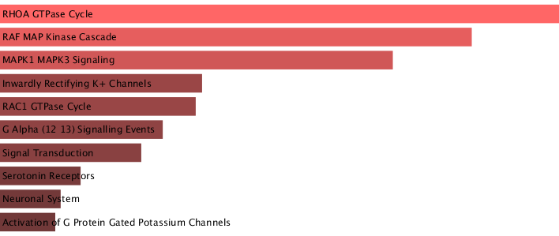
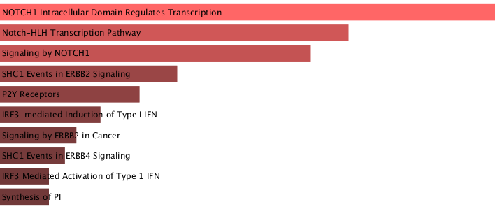

# HDAC1 ATAC-seq Analysis

## Overview

Implemented a modular Nextflow DSL2 ATAC-seq pipeline to profile chromatin accessibility in mouse conventional dendritic cells (cDC1 and cDC2) following knockout of the histone deacetylase HDAC1.

The workflow performs read QC, trimming, alignment, ATAC-specific QC (mitochondrial fraction, FRiP, TSS enrichment), peak calling, reproducibility filtering, differential accessibility analysis, motif enrichment, and pathway integration.

## Biological Question

How does loss of the chromatin regulator HDAC1 reshape the accessible chromatin landscape of dendritic-cell subsets, and does it globally disrupt promoter accessibility or act at specific regulatory loci to influence DC lineage transcription factor networks?

## Dataset

* Study: HDAC1-dependent control of dendritic-cell development and anti-tumor immunity (reproduction of Figure 6a–f)
* Organism: _Mus musculus_ (mm10 / GRCm38)
* Cell types: Conventional dendritic cells — cDC1 and cDC2
* Conditions: Wild-type (WT) and HDAC1 knockout (KO)
* Samples: cDC1 WT ×2, cDC1 KO ×2, cDC2 WT ×2, cDC2 KO ×2 (8 libraries, 2 replicates per group)
* Sequencing: Single-end (Illumina), 50–51 bp
* Accessions: SRR28895183–SRR28895190 (SRA)

## Workflow

DOWNLOAD → FASTQC + TRIM (Trimmomatic) → BOWTIE2_BUILD → BOWTIE2_ALIGN → SAMTOOLS_SORT/IDX/MITO/FLAGSTAT → MULTIQC → DEEPTOOLS (BamCoverage, MultiBwSummary, PlotCorrelation) → MACS3 (peak calling) → BEDTOOLS (replicate intersection & blacklist removal) → DIFFBIND + edgeR (differential accessibility) → HOMER (motif enrichment & annotation) → DEEPTOOLS (computeMatrix & plotHeatmap) → TSS enrichment / FRiP / mitochondrial-fraction QC

Implemented using modular Nextflow DSL2 processes.



## Usage

**1. Clone the repository**

```
git clone https://github.com/taraobma/atac-seq.git
cd atac-seq
```

**2. Run the pipeline**

```
nextflow run main.nf -profile singularity,cluster
```

**Requirements:** Nextflow ≥ 22.0, Singularity (or Conda via `-profile conda`)

> **Note:** Developed and tested on the BU SCC HPC cluster using containers and the SGE executor.

## Quality Control

* MultiQC v1.19 / FastQC v0.11.9: six of eight libraries passed all core FastQC modules; cDC1_KO_2 flagged per-base sequence content and cDC1_WT_2 flagged adapter content
* GC content tightly clustered between 47.0% and 49.0%; <1% overrepresented sequences per library
* Adapters and low-quality bases trimmed with Trimmomatic v0.39, dropping 14.8–24.9% of reads and leaving 26–34M surviving reads per sample with uniform 50–51 bp length
* Alignment to mm10 with Bowtie2 was highly successful: only 0.4–0.5% unmapped reads (>99.5% mapping efficiency), 19.6–28.5M uniquely mapped reads per library
* Duplication rates moderate (14.6–24.7%, most 15.5–19.3%); duplicate and mitochondrial reads removed post-alignment
* High within-group replicate correlation confirmed by DeepTools (Spearman)



### ATAC-specific QC

* **Mitochondrial fraction:** 0.5% (cDC1_KO_1) to 4.7% (cDC2_KO_2); most libraries 0.5–3%, leaving ample nuclear reads for peak calling
* **FRiP:** 0.186 (cDC1_WT_2) to 0.248 (cDC2_KO_2); ~one-fifth to one-quarter of usable reads in consensus peaks, indicating good signal-to-noise
* **TSS enrichment:** ~7–9% of nuclear reads within ±1 kb of annotated mm10 TSSs, confirming strong promoter-proximal enrichment; comparable between WT and KO

| Sample    | Total Reads | Mito Fraction | FRiP   |
|-----------|-------------|---------------|--------|
| cDC1_WT_1 | 22,562,160  | 0.52%         | 0.2027 |
| cDC1_WT_2 | 23,392,763  | 0.54%         | 0.1857 |
| cDC1_KO_1 | 23,881,269  | 0.52%         | 0.1970 |
| cDC1_KO_2 | 23,808,167  | 1.20%         | 0.2350 |
| cDC2_WT_1 | 16,795,019  | 1.98%         | 0.2382 |
| cDC2_WT_2 | 18,677,978  | 3.07%         | 0.1906 |
| cDC2_KO_1 | 22,789,684  | 2.23%         | 0.2298 |
| cDC2_KO_2 | 20,206,434  | 4.67%         | 0.2476 |

## Key Results

> High-confidence gain/loss DARs (P < 0.01) | Preserved global TSS accessibility | ETS-family (PU.1/SpiB) motifs dominant | Distinct cDC1 vs. cDC2 pathway programs

### Differential Accessibility (DiffBind + edgeR)

* Peaks called per sample with MACS3, intersected between replicates with BEDtools, and filtered against the ENCODE mm10 blacklist
* DiffBind + edgeR identified high-confidence differentially accessible regions (DARs) at raw P < 0.01, requiring peaks present in ≥2 samples with ≥10 total reads
* DARs separated into **gain** (logFC > 0, more accessible in KO) and **loss** (logFC < 0) sets for each cell type
* TSS heatmaps show sharp, symmetric enrichment at transcription start sites in both WT and KO, with nearly identical replicate profiles — global promoter accessibility is largely preserved, so HDAC1 effects appear localized to specific loci rather than genome-wide




### Motif Enrichment

Top enriched known motifs (HOMER) at differentially accessible regions in both cDC1 and cDC2:

* PU.1 (SPI1) and SpiB — dominant ETS family
* ELF5, Elf4, ELF3, ETS1, EHF
* IRF8/PU.1 composite and CTCF/CTCFL sites
* cDC1 additionally showed prominent AP-1 / BATF-related signatures

The dominance of ETS-family motifs, alongside IRF and architectural CTCF sites, points to classical DC lineage regulators shaping the accessibility differences between WT and KO.




### Pathway Enrichment (Enrichr, Reactome)

Genes near DARs enriched for distinct programs by cell type:

* **cDC2:** RHOA/RAC1 GTPase cycles, RAF–MAPK and MAPK1/MAPK3 signaling, G-alpha (12/13) signaling — cytoskeletal dynamics and MAPK signal transduction
* **cDC1:** NOTCH1 intracellular-domain transcription, Notch–HLH pathway, signaling by NOTCH1, plus ERBB2/ERBB4 and type I interferon modules




## Biological Interpretation

* HDAC1 loss does not globally collapse or expand chromatin accessibility — promoter/TSS regions remain strongly and symmetrically accessible in all WT and KO conditions
* Regulatory effects of the knockout are confined to specific loci and regulatory modules rather than a genome-wide shift, as reflected by focused gain/loss DARs
* Shared ETS-family (PU.1, SpiB), IRF, and CTCF motif enrichment indicates that core DC lineage and genome-organizing factors drive the accessibility changes in both subsets
* Divergent pathway signatures — Notch/interferon in cDC1 versus Rho/MAPK signal transduction in cDC2 — suggest HDAC1 modulates distinct downstream networks in each dendritic-cell subset

## Comparison to Original Study

Reproduction was partially successful. The TSS heatmaps differ visually from the original Figure 6A/6B but support the same conclusion — promoters stay accessible across all DC conditions and the knockout does not globally disrupt TSS openness. The original "gain" and "loss" panels resolve distinct region subsets, whereas this analysis shows robust symmetric TSS enrichment in both WT and KO, implying knockout effects are confined to specific loci. Figures 6C and 6E were not fully reproduced. Observed differences are attributable to methodological choices (peak-calling and reproducibility filtering, differential-testing thresholds) rather than biological discrepancies.

## Technical Highlights

* Modular Nextflow DSL2 pipeline with Singularity/Conda containers on HPC
* ATAC-specific QC suite: mitochondrial fraction, FRiP, and TSS enrichment
* Automated reproducibility filtering via BEDtools intersection + blacklist removal
* Differential accessibility with DiffBind + edgeR, split into gain/loss sets
* Motif discovery and annotation via HOMER; pathway integration via Enrichr/Reactome

## Repository Structure

```
├── main.nf                              # Main Nextflow pipeline
├── nextflow.config                      # Configuration file
├── samplesheet.csv                      # Sample sheet (SRA FASTQ URLs)
├── run_diffbind.R                       # DiffBind + edgeR differential accessibility
├── enrichr.py                           # Gene-list export for Enrichr
├── report.ipynb                         # Analysis report notebook
├── modules/                             # Modular process definitions
│   ├── download/main.nf
│   ├── fastqc/main.nf
│   ├── trimmomatic/main.nf
│   ├── bowtie2_build/main.nf
│   ├── bowtie2_align/main.nf
│   ├── samtools_view/main.nf
│   ├── samtools_sort/main.nf
│   ├── samtools_idx/main.nf
│   ├── samtools_mito/main.nf
│   ├── samtools_flagstat/main.nf
│   ├── samtools_frip/main.nf
│   ├── mito_fraction/main.nf
│   ├── merge_frip/main.nf
│   ├── merge_mito/main.nf
│   ├── multiqc/main.nf
│   ├── macs3_callpeaks/main.nf
│   ├── bedtools_intersect/main.nf
│   ├── bedtools_remove/main.nf
│   ├── diffbind/main.nf
│   ├── homer_findmotifsgenome/main.nf
│   ├── homer_annotatepeaks/main.nf
│   ├── deeptools_bamcoverage/main.nf
│   ├── deeptools_multibwsummary/main.nf
│   ├── deeptools_plotcorrelation/main.nf
│   ├── deeptools_computematrix/main.nf
│   ├── deeptools_plotheatmap/main.nf
│   ├── deeptools_tss_enrichment/main.nf
│   └── deeptools_fragment_size/main.nf
├── envs/                                # Conda environment definitions
├── diffbind/                            # DiffBind samplesheets & significant-peak BEDs
├── figures_tables/                      # Plots, tables, and QC reports
└── .gitignore
```

## Tools Used

* FastQC v0.12.1
* MultiQC v1.19
* Trimmomatic v0.39
* Bowtie2
* Samtools v1.17
* DeepTools v3.5.1
* MACS3
* BEDtools v2.30
* HOMER v4.11.1
* DiffBind + edgeR (Bioconductor)
* Enrichr (Reactome Pathways)
* Nextflow
* Singularity
